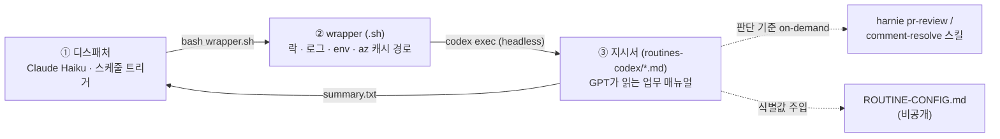

# 자동화 루틴 — "Claude 트리거 + GPT 실행" 아키텍처

PR 리뷰·배포 승인·리뷰 댓글 해결·품질 다이제스트를 사람 개입 없이 굴리는 상시 루틴 5종의 설계와 템플릿.
핵심 설계 목표는 **토큰 경제**다: 비싼 모델은 아무 일도 없는 폴링에 소모하지 않고, 실제 판단이 필요한 순간에만 투입한다.

## 구조 (3층)

| 층 | 역할 | 모델/기술 | 비용 특성 |
|---|---|---|---|
| ① 디스패처 | 스케줄 발화, wrapper 실행, summary만 읽어 보고 | Claude Haiku (스케줄 태스크) | 회차당 수백 토큰 |
| ② wrapper | 중복실행 락(mkdir+PID), 회차별 로그 보존, `AZURE_CONFIG_DIR` 고정, `approval_policy=never` | bash + launchd | 0 |
| ③ 지시서 | 감지→판단→실행→보고의 전체 업무 로직 | codex exec (GPT) | 실작업 시에만 문서·코드 읽기 |

## 루틴 5종

| 템플릿 | 하는 일 | 주기 |
|---|---|---|
| [slack-pr-review-autopilot](templates/slack-pr-review-autopilot.md) | 리뷰요청 채널 감지 → ADO PR 자동 리뷰(댓글+투표) | 10분 |
| [qa-deploy-approval-autopilot](templates/qa-deploy-approval-autopilot.md) | 배포승인 요청 검토 → 봇 ✅ → quorum 도달 시 Jira 자동 전환, 보류 추적 | 10분 |
| [azdo-pr-comment-resolver](templates/azdo-pr-comment-resolver.md) | 내 리뷰 지적에 대한 작성자 답변을 검증 후 resolve·재투표 | 10분 |
| [azdo-pr-completed-comment-resolver](templates/azdo-pr-completed-comment-resolver.md) | 머지된 PR의 미해결 스레드 사후 정리 | 평일 17시 |
| [quality-digest-weekly](templates/quality-digest-weekly.md) | 누적 지적 클러스터링 → 팀 컨벤션 승격 후보 DM (제안만, 자동 반영 금지) | 금 08:00 |

보조 템플릿: [example-wrapper.sh](templates/example-wrapper.sh) · [example-dispatcher-SKILL.md](templates/example-dispatcher-SKILL.md) · [ROUTINE-CONFIG.example.md](templates/ROUTINE-CONFIG.example.md)

## 설계 원칙

- **no-op 폴링 최소 비용**: 판단 기준 문서(pr-review 스킬 등)는 처리할 대상이 확정된 뒤에만 읽는다. 새 요청이 없는 폴링은 문서를 하나도 열지 않는다.
- **멱등성이 1급 요구사항**: watermark + 10분 오버랩 스캔(뒤늦은 수정·직전 오판 회수), PR 단위 "이미 내 댓글 있음" 판정, 모든 봇 답글에 멱등 마커. 같은 메시지를 두 경로가 이중 처리하지 않도록 신규 수집과 보류 후속을 분리.
- **식별값 주입**: 지시서에 채널 ID·계정·조직명을 하드코딩하지 않고 실행 시작 시 ROUTINE-CONFIG를 읽는다. 이 분리 덕에 지시서를 거의 그대로 공개할 수 있다.
- **쓰기 실패에도 상태는 전진**: 답글 게시가 실패해도 보류 등록은 수행 — 보고 채널의 장애가 추적 상태를 오염시키지 않는다.

## 운영에서 배운 것 (실사고 → 규칙)

1. **리뷰 누락**: 멘션 없이 게시 후 수정·재전송된 메시지가 watermark를 지나침 → 10분 오버랩 스캔 + "이전에 봤다"는 이유로 메시지를 스킵하지 않는 규칙(멱등은 PR 단위로 보장).
2. **지적 유실**: 지적을 타 리뷰어 스레드의 답글로 달자 후속 루틴(내가 루트인 스레드만 추적)에서 유실 → "지적은 반드시 내가 루트인 새 스레드로" 불변식 + eviction 2조건 가드.
3. **headless에서 MCP 쓰기 전멸**: `codex exec`는 전역 `approval_policy=on-request` 때문에 MCP 쓰기 툴이 전부 자동 취소됨 → wrapper에 `-c approval_policy=never` 필수.
4. **상태명 정확일치의 함정**: Jira 상태명 공백 차이("배포 승인" vs "배포승인")로 전환 실패 → 상태명 비교는 항상 공백 제거 후.
5. **샌드박스와 az 인증**: workspace-write가 `~/.azure` 쓰기를 막아 루틴이 토큰을 /tmp로 복사하는 위험한 즉흥 우회를 시작 → wrapper가 `AZURE_CONFIG_DIR`를 루틴 전용 경로로 고정하고 최초 1회만 시드.
