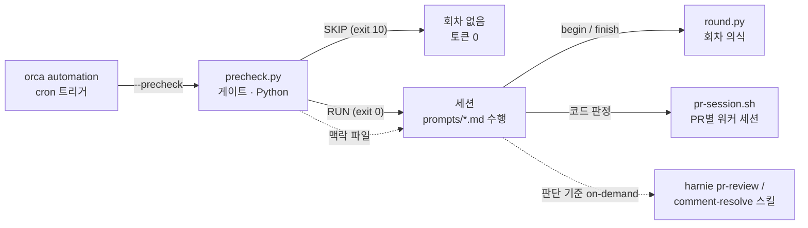

# 자동화 루틴 — orca automation + precheck 게이트

PR 리뷰·배포 승인·리뷰 댓글 해결·컨벤션 다이제스트를 사람 개입 없이 굴리는 상시 루틴 6종. 설계 목표는 **토큰 경제**이고, 그 축은 읽는 양이 아니라 **턴 수**다. 세션이 도구를 한 번 부를 때마다 그때까지의 컨텍스트가 통째로 다시 실리므로, 결정적인 작업을 LLM 세션 밖으로 빼는 것이 비용을 줄이는 유일한 축이다.

> 비공개 실행본의 **스냅샷 정제본**이다. 회사 식별자·실명·내부 좌표는 플레이스홀더로 치환했다. 실행본과 자동 동기화되지 않는다.

## 구조



| 층 | 역할 | 토큰 |
|---|---|---|
| `precheck.py` | 새 신호가 없으면 회차 자체를 막는다. Slack 워터마크·ADO digest·worklist를 보고 RUN/SKIP을 정한다 | 0 |
| 맥락 파일 | precheck가 이미 얻은 것을 세션에 넘긴다 — 설정 해석값, PR 상태·커밋, PR 소속 diff 파일 경로 | 0 |
| `round.py` | 회차의 앞뒤 의식(락·스냅샷·인증·폴드 / commit·sweep·해제)을 각 한 번으로 접는다 | 0 |
| `pr-session.sh` | 코드 판정을 PR별 워커 세션으로 내보낸다. diff가 오케스트레이터 컨텍스트에 들어가지 않는다 | 워커 쪽만 |
| 세션 | 판단만 한다 | 실작업 시에만 |

## 루틴 6종

| 프롬프트 | 하는 일 | 주기 |
|---|---|---|
| `pr-review-intake` | 리뷰요청 채널 감지 → PR 리뷰(댓글·투표) → worklist 등록 | 10분 |
| `pr-review-resolve` | 내 지적에 대한 작성자 답변 검증 → resolve·재투표 | 10분 |
| `pr-review-merged` | 머지된 PR의 미해결 스레드 사후 정리 | 평일 17시 |
| `deploy-approve-intake` | 배포승인 요청 검토 → 봇 ✅ → quorum 도달 시 Jira 전환, 보류 등록 | 10분 |
| `deploy-approve-resolve` | 보류 항목 재확인 → 해소 판정 | 10분 |
| `code-convention-digest` | 해소된 지적 군집화 → 컨벤션 승격 후보 DM | 매주 금 |

## 이 구조가 막는 것

측정해서 없앤 낭비들이다. 같은 실수를 반복하지 않으려면 이것만 봐도 된다.

- **프롬프트 재읽기·자기 검색.** 트리거가 본문을 이미 준다. 다시 읽고 `rg`로 자기 계약을 찾으면 그 출력이 회차가 끝날 때까지 매 턴 다시 실린다.
- **설정 파일 재읽기.** precheck가 이미 파싱했다. 해석값을 맥락 파일에 실어 세션이 원문을 안 읽게 한다.
- **워커의 결정적 git.** `srcCommit`·`tgtCommit`만 알면 diff는 전부 결정적이다. precheck가 `numstat`·`patch`로 떨구고 워커 지시에 경로를 박는다. 요약은 `--stat`이 아니라 `--numstat`이다(긴 경로가 잘려 리뷰 스레드의 filePath로 못 쓴다). rename은 `--no-renames`로 푼다(brace 표기는 실제 경로가 아니다).
- **원장 통째 읽기.** 세션이 숫자 하나를 얻으려고 수백 건짜리 파일을 읽는다. 읽기는 맥락으로, 쓰기는 스크립트로 뺀다.
- **회차 고정 의식.** 할 일 없는 회차조차 락·스냅샷·인증·폴드·해제에 10턴 넘게 쓴다. `round.py`가 둘로 접는다.

## 파일

```
prompts/    automation 6종의 지시서. 트리거가 이 경로를 주고 세션이 그대로 수행한다.
bin/
  precheck.py       게이트 판정 + 맥락 파일 생성 (RUN=0 · SKIP=10)
  precheck.sh       automation의 --precheck 진입점. 10만 SKIP으로 넘긴다
  round.py          begin/finish — 회차 앞뒤 의식
  guarded.sh        lock check와 그 뒤의 쓰기를 한 턴으로
  lock.sh           mkdir 원자성 기반 락. 30분 초과는 좀비로 회수
  fold-worklist.py  append-only 이벤트를 활성 집합으로 접는다
  mark.py           watermark 파일의 read-modify-write
  prior-review.py   한 PR의 이전 리뷰 기록만 세 원장에서 걸러낸다
  pr-session.sh     PR별 워커 세션의 수명주기 (ensure/ask/close/sweep)
  az                automation별 AZURE_CONFIG_DIR 격리 래퍼
  fetch-repos.sh    PR ref fetch
  seed-azure.sh     az 프로필·확장 시드 (1회)
  create-automations.sh  orca automation 생성 (1회)
  token-report.py   회차 토큰 사용량 집계
templates/ROUTINE-CONFIG.example.md   식별값 주입 문서의 필드 구조
```

## 적용

1. `templates/ROUTINE-CONFIG.example.md`를 채워 `~/work/ROUTINE-CONFIG.md`로 둔다. **필드 형식을 바꾸지 않는다** — `bin/precheck.py`의 파서가 그 줄 모양을 읽는다.
2. `~/work/`는 사내 레포를 클론해 두는 루트다. 자기 환경에 맞게 스크립트·프롬프트의 경로를 바꾼다.
3. `bash bin/seed-azure.sh`로 az 프로필과 확장을 시드한다.
4. `bash bin/create-automations.sh`로 automation을 `--disabled`로 만든 뒤, dry-run으로 회차를 확인하고 `state/live/<automation>.enabled`를 만들어 라이브로 올린다.

판단 기준(무엇을 지적하고 무엇을 해소로 볼지)은 이 저장소에 없다. 프롬프트가 실행 시점에 [harnie](https://github.com/qnamy/harnie)의 `pr-review`·`comment-resolve`·`deploy-approval`·`quality-digest` 스킬을 읽는다.

## 상태

`state/`는 커밋하지 않는다. 봇 토큰이 거기 있고, 나머지도 전부 런타임 산출물이다.

| 파일 | 쓰는 쪽 | 내용 |
|---|---|---|
| `gate/pending·snapshot·<automation>.json` | precheck / 세션 | 게이트 신호의 3단(관측·회차 스냅샷·커밋) |
| `gate/context.<automation>.json` | precheck | 세션에 넘기는 해석값 — 설정·PR 상태·diff 경로 |
| `*-worklist.jsonl` | 세션 | append-only 이벤트. `fold-worklist.py`가 접는다 |
| `marks/<automation>.json` | `mark.py` | 수집 창의 watermark |
| `review-findings.jsonl`·`pr-review-summary.jsonl`·`code-quality-list.jsonl` | 세션 | 지적·요약·해소 원장 |
| `locks/`·`pr-sessions/`·`diff/` | 스크립트 | 락, 워커 세션 대장, 떨군 diff |
